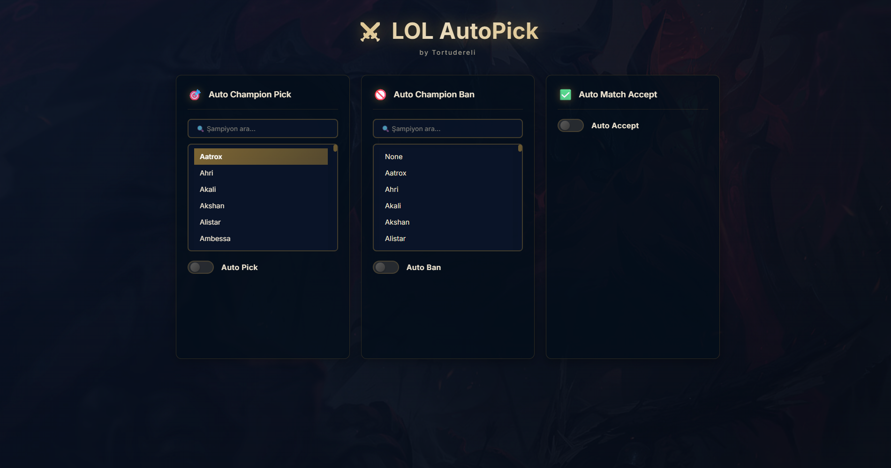

# ⚔️ LoL AutoPick

<div align="center">

**[🇹🇷 Türkçe](README.tr.md) | 🇬🇧 English**

  
  
  <p><strong>Automatic Champion Selection and Match Accept Application for League of Legends</strong></p>
  
  [](https://opensource.org/licenses/MIT)
  [](https://github.com/Tortudereli/lol-autopick/releases)
  [](https://github.com/Tortudereli/lol-autopick)
</div>

## 📥 Download

**[LoL AutoPick Setup - Download](https://github.com/Tortudereli/lol-autopick/releases/download/1.0.0/LoL-AutoPick-Setup.exe)**

## Changelog
- A 7-second delay was added to showing the selected champion during the champion selection preparation stage.

## ✨ Features

- **🎯 Auto Champion Pick**: Automatically picks your selected champion
- **🚫 Auto Champion Ban**: Automatically bans your selected champion
- **✅ Auto Match Accept**: Automatically accepts when a match is found
- **🔍 Champion Search**: Quick champion selection with search feature
- **🎨 Modern Interface**: User-friendly and elegant design
- **🔄 Auto League Client Detection**: Automatically connects when the game is launched

## 🚀 How to Use?

1. **Download and Install**: Download the setup file from the link above and run it
2. **Launch League of Legends**: Open the LoL client after running the application
3. **Select Your Champions**: 
   - Choose the champion you want to pick from the "Auto Champion Pick" section
   - Choose the champion you want to ban from the "Auto Champion Ban" section
4. **Enable Features**:
   - "Auto Pick" - Enables automatic champion selection
   - "Auto Ban" - Enables automatic champion ban
   - "Auto Accept" - Enables automatic match accept
5. **Start Queue**: The application will run in the background and automatically make your selections

## 🛠️ Developer Setup

If you want to develop the project or compile from source code:

### Requirements

- [Bun](https://bun.sh/) (JavaScript runtime and package manager)
- [Node.js](https://nodejs.org/) (for Electron)
- Windows Operating System

### Installation

```powershell
# Clone the repository
git clone https://github.com/Tortudereli/lol-autopick.git
cd lol-autopick

# Install dependencies
bun install
```

### Development Mode

```powershell
# Start the application in development mode
bun start
```

### Build Application

```powershell
# Package the application
bun run package

# Create installer
bun run make
```

The compiled files will be created in the `out/make/squirrel.windows/x64/` folder.

## 🏗️ Technologies

- **Electron** - Cross-platform desktop application
- **TypeScript** - Type-safe code
- **Vite** - Fast build tool
- **LCU API** - League Client Update API

## 📋 Project Structure

```
lol-autopick/
├── src/
│   ├── main.ts          # Main Electron process
│   ├── preload.ts       # Preload script
│   ├── renderer.ts      # Renderer process (UI)
│   └── index.css        # Styles
├── public/
│   ├── app.ico          # Application icon
│   ├── app.png          # Application image
│   └── waiting-lol.html # Waiting screen
├── forge.config.ts      # Electron Forge configuration
└── package.json         # Project dependencies
```

## 🔒 Security

This application interacts with your game using the League of Legends Client Update (LCU) API. The application:
- Only runs on local (127.0.0.1)
- Does not send your game data outside
- Is open source and can be reviewed

## ⚠️ Disclaimer

This application is not an official Riot Games product. Use at your own risk. Please ensure you are not violating Riot Games' Terms of Service.

## 📝 License

This project is licensed under the MIT License. See the [LICENSE](LICENSE) file for details.

## 👤 Developer

**Tortudereli**
- Email: tortudereli@outlook.com
- GitHub: [@Tortudereli](https://github.com/Tortudereli)

## 🤝 Contributing

Contributions are welcome! Feel free to submit your pull requests.

1. Fork the project
2. Create your feature branch (`git checkout -b feature/amazing-feature`)
3. Commit your changes (`git commit -m 'feat: Add amazing feature'`)
4. Push to the branch (`git push origin feature/amazing-feature`)
5. Open a Pull Request

## 📞 Support

You can use the [GitHub Issues](https://github.com/Tortudereli/lol-autopick/issues) page to report bugs or make suggestions.

---

<div align="center">
  Made with ❤️ by Tortudereli
</div>
